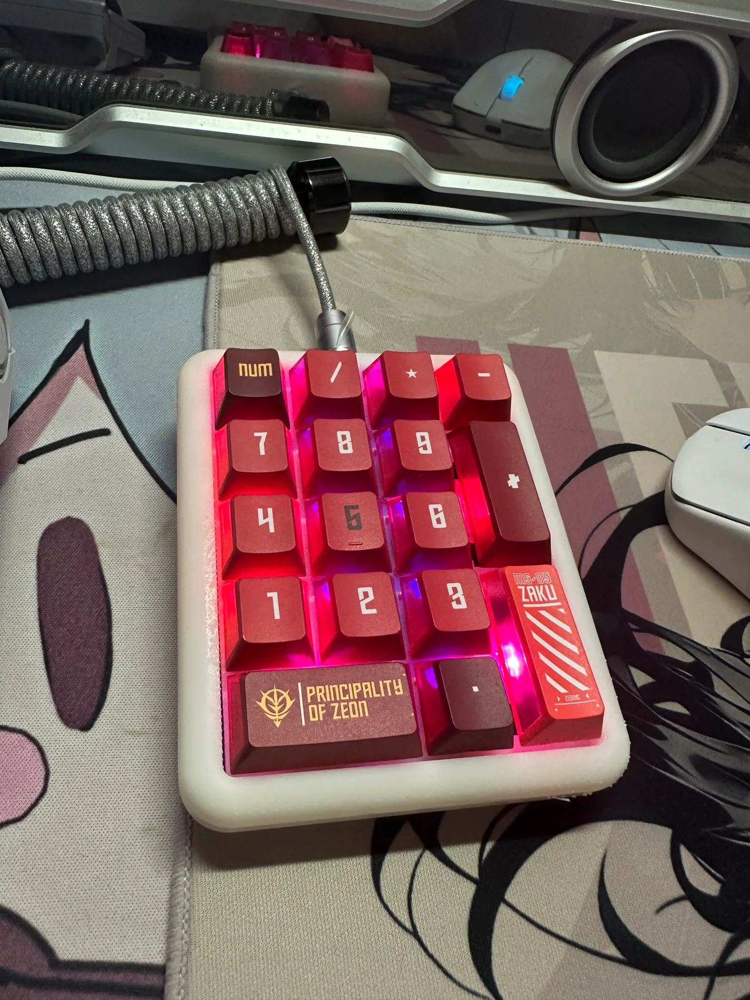
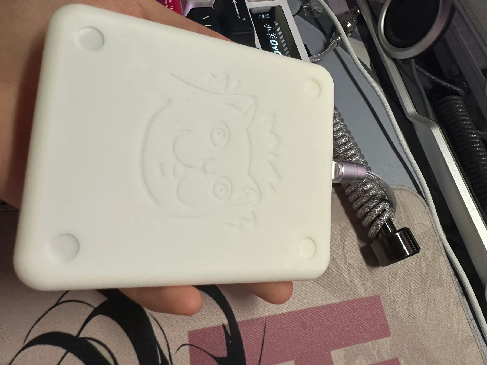

# STM32 17 键数字小键盘｜个人复刻记录

基于 [morempty 的 STM32 数字小键盘](https://oshwhub.com/morempty/STM32-PAD-17jian-shuo-zi-jian-pa)制作。PCB 设计和原始固件来自原作者；本仓库记录个人焊接、烧录、排障、装配和键位调整过程，并维护基于原项目 `w17` 目录的键盘配置源码。

  

查看外壳背面

  

## 完成状态

已完成 PCB 焊接、Bootloader 和 QMK 固件烧录、按键排障、键帽与外壳装配。Type-C 连接后键盘和 RGB 灯可以工作；`9` 键的虚焊问题已修复，左上角 `Num` 键已在设备中改为普通 Num Lock。实物与测试记录见 [测试记录](docs/test-report.md)。

## 硬件与软件

| 项目 | 本次复刻使用情况 |
| --- | --- |
| 主控 | STM32F103C8T6，64 KB Flash |
| 按键 | 17 键数字小键盘，热插拔轴座 |
| 灯光 | 17 颗 WS2812B-2020，QMK RGB Matrix |
| 连接 | Type-C USB 有线连接 |
| 固件 | 原项目提供的 `stm32duino_bootloader.bin` 和 `w17_pad.bin` |
| 改键 | Vial 动态键位：第 0 层左上角设为 `KC_NUMLOCK` |

上表描述本次实物，不代表所有替代芯片或改版 PCB 都兼容原项目固件。

## 使用与复刻

- **日常使用**：通过可传输数据的 Type-C 线连接电脑。左上角 `Num` 键现在是普通 Num Lock；需要输入数字时，确认系统的 Num Lock 已开启。键位布局和改键方式见 [键位与灯效](docs/keymap.md)。
- **首次烧录**：使用 ST-Link V2 通过 PCB 的四个 SWD 触点写入 Bootloader，再通过 Type-C 和 QMK Toolbox 写入 QMK 固件。接线、地址、校验和驱动处理见 [烧录指南](docs/flashing.md)。
- **遇到单键不响应**：先检查轴体、热插拔座、二极管及焊点，再核对 QMK/Vial 键位。实际遇到的 `9` 键和 `Num` 键问题见 [故障排查](docs/troubleshooting.md)。

`v1.0.0` Release 没有附 `.bin` 文件。已实测的两个固件来自[原项目附件区](https://oshwhub.com/morempty/STM32-PAD-17jian-shuo-zi-jian-pa)；本仓库新源码的编译产物可从 Actions 下载，但尚未完成实物刷写验收，详见[编译说明](docs/building.md)。不要把 Bootloader 和键盘应用固件选反。

## 仓库内容

| 路径 | 内容 |
| --- | --- |
| [`firmware/qmk/w17/`](firmware/qmk/w17/) | 基于原作者目录调整的键位与硬件配置 |
| [`firmware/build-lock.json`](firmware/build-lock.json) | 选定的 Vial-QMK、Python 与工具链基线 |
| [`config/vial/`](config/vial/) | 从实物读取的 4 层键位备份和恢复说明 |
| [`docs/building.md`](docs/building.md) | 固定版本编译、Actions 产物与验证边界 |
| [`docs/flashing.md`](docs/flashing.md) | ST-Link 与 QMK Toolbox 两阶段烧录步骤 |
| [`docs/keymap.md`](docs/keymap.md) | 当前键位、Vial 改键与源码差异 |
| [`docs/troubleshooting.md`](docs/troubleshooting.md) | 本次复刻中遇到的故障和处理 |
| [`docs/test-report.md`](docs/test-report.md) | 实物、烧录和功能测试记录 |
| [`docs/test-checklist.md`](docs/test-checklist.md) | 逐键、USB、睡眠唤醒与装配验收表 |
| [`docs/assembly.md`](docs/assembly.md) | 原作者 3D 模型、打印建议与装配顺序 |
| [`assets/photos/`](assets/photos/) | 本次完成品照片，已缩小并去除相机元数据 |

2026-09-30 起，源码默认 Num 键已同步为普通 Num Lock，并建立[固定版本编译流程](docs/building.md)。`v1.0.0` 和原作者 `w17_pad.bin` 仍保留原先的双功能键。新的编译产物与正在使用的原作者固件是不同文件；编译结果和实物验收分别记录。键位备份不包含宏和完整灯光配置，范围见[备份说明](config/vial/README.md)。

## 来源与许可

原始 PCB 设计、BOM 和固件请以 [morempty 原项目](https://oshwhub.com/morempty/STM32-PAD-17jian-shuo-zi-jian-pa)为准；原项目页面标注 **CC BY-NC-SA 3.0**，要求署名、相同方式共享且不得商用。仓库内 QMK 相关源码还保留各文件自己的版权与许可证声明。本仓库的个人复刻记录和照片不改变原作者对其设计及源码所享有的权利。
